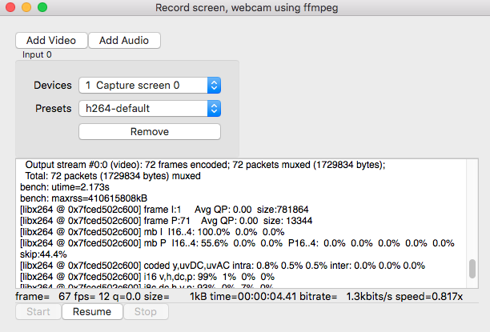

`ffmpegui` is a GUI frontend for ffmpeg which can record screen and webcam with audio. Encoding and source options can be configured from the UI.

* `ffmpeg` needs to installed for separately. Use `homebrew` for Mac and package manager for your linux distribution to install ffmpeg.
* Each Pause/Resume will create a new file and all the files are joined after stop.
* Capture is made using intermediate fast capture-{a,v} profile, then converted to seleced profile and joined together.
* Captures are stored in Desktop and configuration files are stored in [user level configuration](https://github.com/shibukawa/configdir) directory.

## TODO

* linux support
* better input and output resolution, framerate configuration `ffprobe -f avfoundation -i 0`
* capture selected application window(s)
* support for input videos to transcode
* tray icon with status and stop, pause support
* capture to webp/gif animations